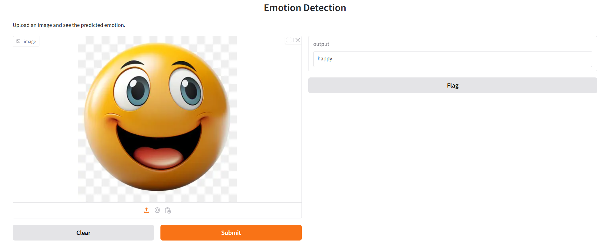
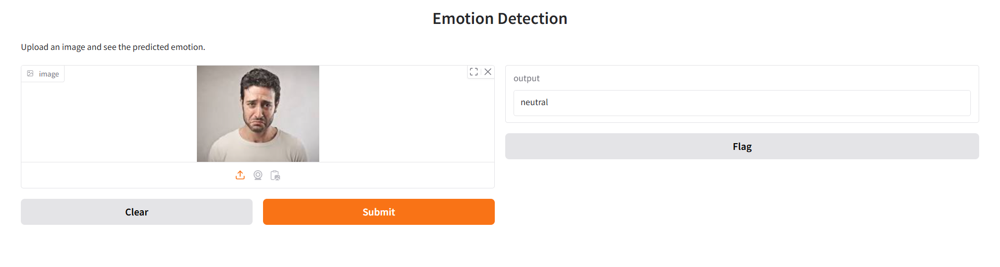
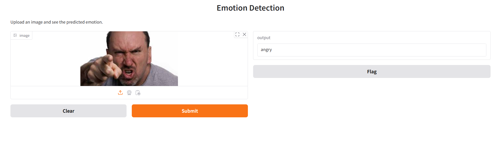

<<<<<<< HEAD
# Emotion Detection Using CNN and FER-2013 Dataset

## Description

This project focuses on emotion detection using deep learning models trained on the FER-2013 dataset. Key aspects include:

- Addressed class imbalance using image augmentation and class weights to improve model robustness.
- Designed and iterated on custom CNN models, as well as advanced architectures like VGG16 and ResNet50v2 for optimized performance.
- Achieved a **66% overall accuracy** on emotion classification, with the final model based on ResNet50v2, evaluated using precision, recall, and F1-scores across 7 emotion labels.

## Tech Stack

- Python
- TensorFlow
- Keras
- ResNet50v2
- VGG16
- Gradio

## Deployment

The final model was deployed using **Gradio**, enabling an interactive web-based interface.

## Here is a predicted images on this project
#### Original - Happy , Predicted - Happy

   

#### Original - Sad , Predicted - Neutral

#### Original - Angry , Predicted - Angry

=======
# Emotion Detection Using CNN and FER-2013 Dataset

## Description

This project focuses on emotion detection using deep learning models trained on the FER-2013 dataset. Key aspects include:

- Addressed class imbalance using image augmentation and class weights to improve model robustness.
- Designed and iterated on custom CNN models, as well as advanced architectures like VGG16 and ResNet50v2 for optimized performance.
- Achieved a **66% overall accuracy** on emotion classification, with the final model based on ResNet50v2, evaluated using precision, recall, and F1-scores across 7 emotion labels.

## Tech Stack

- Python
- TensorFlow
- Keras
- ResNet50v2
- VGG16
- Gradio

## Deployment

The final model was deployed using **Gradio**, enabling an interactive web-based interface.

## Here is a predicted images on this project
#### Original - Happy , Predicted - Happy

   

#### Original - Sad , Predicted - Neutral

#### Original - Angry , Predicted - Angry

>>>>>>> cfed2aadf9986be04d0192b642978a3f68ed1616
